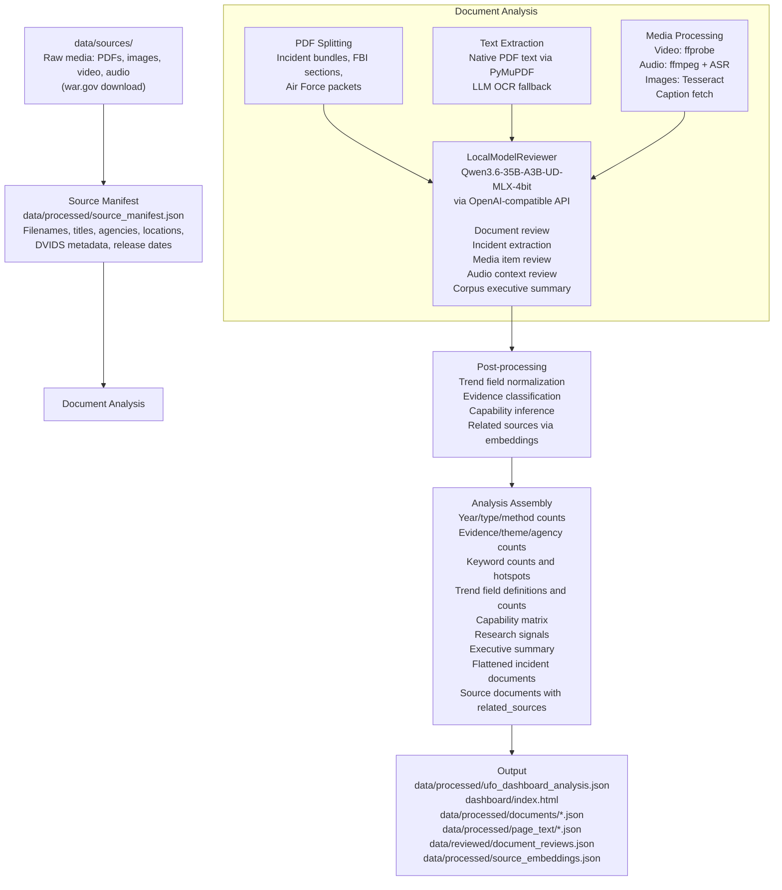
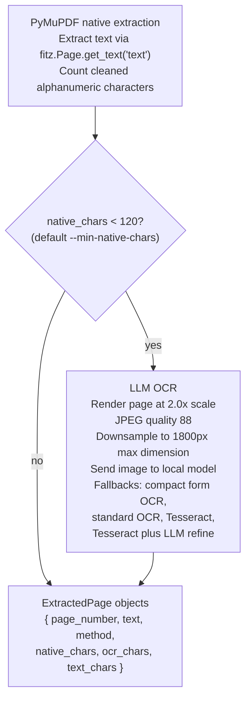
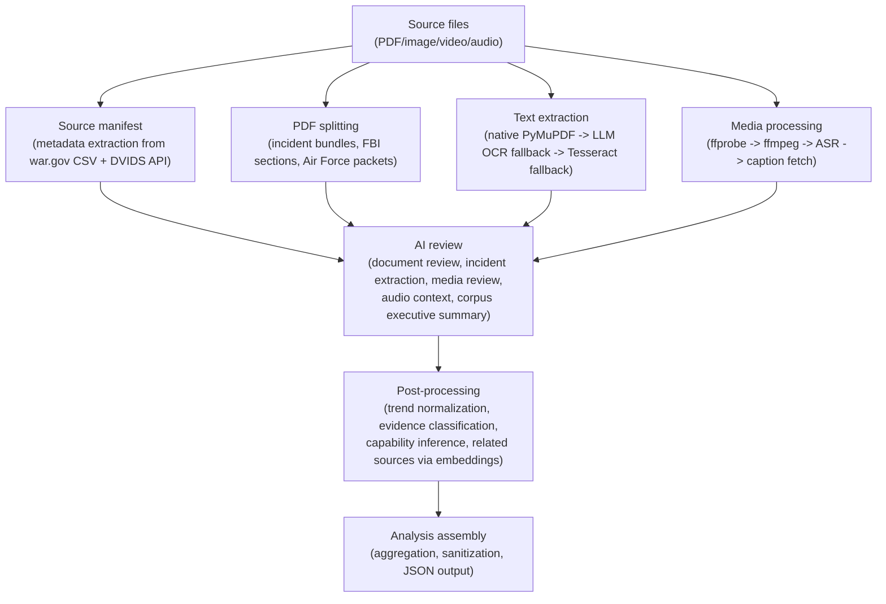

# UFO Analysis Dashboard

A static, self-contained research dashboard for exploring U.S. government UAP/UFO release material. The project downloads source media, extracts text from PDFs/images/audio/video, enriches records with local model review, and builds `dashboard/index.html` plus a structured JSON analysis file.

The current generated analysis covers 221 physical source files, 534 flattened analysis items, and 4,281 source pages across PDF, image, video, and audio material. The dashboard is designed to be served as static files, so it can run locally or deploy to Cloudflare Workers Static Assets without a backend.

## Contents

- [Project Status](#project-status)
- [Data Source](#data-source)
- [Features](#features)
- [Repository Layout](#repository-layout)
- [Prerequisites](#prerequisites)
- [Quick Start](#quick-start)
- [Working With Source Data](#working-with-source-data)
- [Local Model Configuration](#local-model-configuration)
- [Dashboard Build Options](#dashboard-build-options)
- [Deployment](#deployment)
- [Data and Publishing Notes](#data-and-publishing-notes)
- [Data Processing Pipeline](#data-processing-pipeline)
- [License](#license)

## Project Status

This repository is a static dashboard and data-processing pipeline, not a claim-validation system. The analysis uses source metadata, OCR, heuristic classification, and local AI review to organize a public document corpus for research. Review outputs should be treated as generated research aids and checked against the original source files before citation.

The raw `data/` directory is ignored by Git because it can grow very large. A full local corpus currently occupies about 11 GB. The generated dashboard in `dashboard/` is small enough to publish as static assets, but it embeds the generated analysis JSON directly in `dashboard/index.html`.

## Data Source

The source corpus comes from the U.S. Department of War's [Presidential Unsealing and Reporting System for UAP Encounters (PURSUE)](https://www.war.gov/ufo/) release page. The downloader reads the page's public CSV manifest, downloads linked PDFs/images/media files, and enriches video/audio records with DVIDS metadata when available.

This repository is an independent analysis and dashboard project. It is not affiliated with, endorsed by, or operated by the U.S. Department of War or any other government agency.

## Features

- Downloads UFO/UAP release media from the war.gov source manifest.
- Handles PDFs, images, video clips, and audio-like media assets.
- Extracts native PDF text with PyMuPDF and falls back to OCR when page text is sparse.
- Uses Tesseract and a local OpenAI-compatible multimodal model for OCR/review workflows.
- Splits recognized archival bundles into incident-level records.
- Classifies records into evidence categories, themes, agencies, trend fields, and capability signals.
- Uses embeddings to identify related sources and shared factors.
- Produces a single static HTML dashboard with embedded JSON.
- Includes Cloudflare Workers Static Assets configuration.

## Repository Layout

| Path | Purpose |
|---|---|
| `dashboard/index.html` | Generated self-contained dashboard. |
| `dashboard/assets/` | Static dashboard assets. |
| `tools/build_dashboard.py` | Main analysis and dashboard build pipeline. |
| `tools/download_ufo_reports.py` | Downloads source media and writes `source_manifest.json`. |
| `tools/ocr_with_llm.py` | Standalone PDF/image OCR helper backed by a local multimodal model. |
| `tools/assets/ne_110m_land.geojson` | GeoJSON used for dashboard mapping/geographic context. |
| `data/sources/` | Downloaded source media. Ignored by Git. |
| `data/ocr_markdown/` | Markdown OCR outputs used by the builder. Ignored by Git. |
| `data/processed/` | Generated caches and final analysis JSON. Ignored by Git. |
| `data/reviewed/` | Manual/generated review overrides. Ignored by Git. |
| `requirements.txt` | Python package dependencies. |
| `wrangler.toml` | Cloudflare Workers Static Assets config. |

## Prerequisites

Python dependencies:

```sh
python3 -m venv .venv
source .venv/bin/activate
pip install -r requirements.txt
```

System tools used by the full pipeline:

- `ffmpeg` and `ffprobe` for video/audio metadata, frame extraction, and audio extraction.
- Tesseract OCR for image OCR fallback.
- Node.js and `wrangler` only if deploying or previewing with Cloudflare.

On macOS, the system tools can be installed with Homebrew:

```sh
brew install ffmpeg tesseract
```

## Quick Start

If `data/` already exists locally, rebuild the dashboard:

```sh
python3 tools/build_dashboard.py
```

The build writes:

- `dashboard/index.html`
- `data/processed/ufo_dashboard_analysis.json`
- cache files under `data/processed/`

Open the generated dashboard directly in a browser, or serve the folder locally:

```sh
python3 -m http.server 8000 --directory dashboard
```

Then visit `http://localhost:8000`.

For a small scratch build while developing, write outputs outside the canonical dashboard paths:

```sh
python3 tools/build_dashboard.py \
  --max-docs 5 \
  --page-limit 2 \
  --output-html data/processed/scratch/index.html \
  --output-json data/processed/scratch/analysis.json
```

The builder intentionally rejects limited runs that target the canonical `dashboard/index.html` and `data/processed/ufo_dashboard_analysis.json` paths.

## Working With Source Data

Download source media and create the manifest:

```sh
python3 tools/download_ufo_reports.py
```

Useful variants:

```sh
python3 tools/download_ufo_reports.py --media-types pdf,image
python3 tools/download_ufo_reports.py --max-files 10
python3 tools/download_ufo_reports.py --overwrite-existing
```

The downloader writes media into `data/sources/` and metadata into `data/processed/source_manifest.json`.

Run standalone LLM OCR for a document:

```sh
python3 tools/ocr_with_llm.py \
  data/sources/38_143685_box7_Incident_Summaries_1-100.pdf \
  --pages 1 \
  --output-dir data/ocr_markdown
```

OCR options:

- `--pages` accepts selections such as `1`, `1-3`, or `1,4,8-10`.
- `--concurrency` controls simultaneous local model requests. Default: `4`.
- `--pages-per-request` controls how many page images are sent per model call. Default: `1`.
- Existing Markdown outputs are skipped unless `--overwrite` is passed.

## Local Model Configuration

The default full pipeline expects an OpenAI-compatible local endpoint:

| Purpose | Default |
|---|---|
| Review/OCR base URL | `http://localhost:4321/v1` |
| Review/OCR model | `Qwen3.6-35B-A3B-UD-MLX-4bit` |
| Embedding model | `Qwen3-Embedding-0.6B-4bit-DWQ` |
| Audio transcript model | `Qwen3-ASR-0.6B-4bit` |

Override these at build time:

```sh
python3 tools/build_dashboard.py \
  --review-base-url http://localhost:4321/v1 \
  --review-model Qwen3.6-35B-A3B-UD-MLX-4bit \
  --embedding-base-url http://localhost:4321/v1 \
  --embedding-model Qwen3-Embedding-0.6B-4bit-DWQ
```

To build from already prepared OCR/review data without generating new model reviews:

```sh
python3 tools/build_dashboard.py \
  --review-mode manual \
  --related-sources-mode off \
  --audio-transcript-mode captions
```

That mode is useful for public or reproducible runs, but it depends on the required `data/` artifacts already existing locally.

## Dashboard Build Options

Common builder flags:

| Flag | Purpose |
|---|---|
| `--source-dir` | Source media directory. Default: `data/sources`. |
| `--output-html` | Dashboard HTML output path. Default: `dashboard/index.html`. |
| `--output-json` | Analysis JSON output path. Default: `data/processed/ufo_dashboard_analysis.json`. |
| `--site-url` | Canonical public URL used for SEO metadata, `robots.txt`, and `sitemap.xml`. |
| `--review-mode manual|hybrid` | Use only saved reviews or generate missing reviews with the local model. |
| `--refresh-reviews` | Regenerate local model reviews in hybrid mode. |
| `--refresh-document-cache` | Ignore cached document analyses and rebuild them. |
| `--refresh-ocr-markdown` | Regenerate Markdown OCR files before use. |
| `--related-sources-mode auto|off` | Enable or disable embedding-based related source links. |
| `--max-docs` | Limit the number of documents for scratch runs. |
| `--page-limit` | Limit pages per document for scratch runs. |
| `--no-split-source-pdfs` | Keep recognized archival bundles as single source documents. |
| `--min-native-chars` | Native PDF text threshold below which OCR fallback is used. Default: `120`. |

## Deployment

This project is configured for Cloudflare Workers Static Assets. Cloudflare uploads the already-built files in `dashboard/`; it does not run the Python build pipeline.

Deploy the current dashboard:

```sh
npx wrangler deploy
```

Preview with Wrangler:

```sh
npx wrangler dev
```

The Worker configuration lives in `wrangler.toml`.

## Data and Publishing Notes

Before making the repository public, check these items:

- Keep `data/` ignored unless you intentionally want to publish the source corpus and generated caches.
- Review `dashboard/index.html` because it embeds generated analysis data.
- Review local endpoint defaults and API-key placeholders in scripts before inviting external contributors.
- Cite original source material rather than generated summaries when making research claims.
- Consider publishing a smaller reproducible sample dataset if the full corpus is too large for contributors.


## Data Processing Pipeline

This section documents the end-to-end pipeline that transforms raw government media files into the structured JSON consumed by the dashboard. The pipeline is implemented in `tools/build_dashboard.py` and orchestrates text extraction, multimodal review, incident extraction, capability inference, embedding-based relationship detection, and final dashboard assembly.

### 1. Overview



### 2. Source Ingestion

The pipeline begins with media downloaded from the U.S. Department of War's [PURSUE UFO release page](https://www.war.gov/ufo/). `tools/download_ufo_reports.py`:

1. Fetches the CSV manifest from `war.gov/Portals/1/Interactive/2026/UFO/uap-data.csv`.
2. Parses media records by type: PDF, image, video, and audio.
3. For video/audio assets, queries the DVIDS Hub API to resolve the best MP4 file, thumbnail, closed captions, and duration metadata.
4. Downloads each media file to `data/sources/` with sanitized filenames.
5. Writes `data/processed/source_manifest.json`, keyed by filename, with title, media type, original source URL, agency, incident date, location, release date, DVIDS metadata, and narrative fields.

The manifest is the metadata backbone for every downstream document.

### 3. PDF Splitting and Segmentation

Large archival PDFs are split into analytically meaningful segments before analysis. Three bundle types are recognized:

| Bundle Type | Pattern | Splitting Strategy |
|---|---|---|
| Incident bundles | `38_143685_box7_Incident_Summaries_1-100` | Detects incident summary sheet markers and incident numbers; each incident becomes a child document. |
| FBI sections | `65_HS1-834228961_62-HQ-83894_Section_NNN` | Score-based segmentation using memorandum headers, subject lines, dates, and FBI patterns. |
| Air Force packets | `342_HS1-416511228_319.1_Flying_Discs_1949` | Uses the same score-based segmentation approach as FBI sections. |

The package-start score considers government/memorandum headers, subject lines, salutations, date patterns, and declassification/search-slip markers. Very short segments are discarded.

### 4. Text Extraction

Each PDF goes through a multi-stage text extraction pipeline:



The extraction method is recorded per document:

- `native`: all pages had sufficient native text.
- `ocr`: OCR was used.
- `hybrid`: native text and OCR were both used.

Text extraction results are cached in `data/processed/page_text/<filename>.json` with versioning. Cache invalidation checks file size, modification time, and analysis options.

### 5. Document Review

`LocalModelReviewer` connects to the local OpenAI-compatible endpoint and performs several review tasks:

- Document review: samples pages, text excerpts, and selected rendered page images, then asks for structured JSON.
- Incident extraction: chunks OCR text from split incident bundles and extracts incident-level records.
- Media review: extracts image text, video metadata/frames, audio transcripts, and contextual media summaries.
- Audio context review: fills missing audio characterization and transcript summary fields.
- Corpus executive summary: synthesizes a high-level summary from the reviewed corpus.

Structured review fields include `summary_narrative`, `visual_observations`, `document_type`, `themes`, `agencies`, `location_label`, `evidence_category`, and 40+ normalized trend fields.

### 6. Trend Field Normalization

Reviewed documents are normalized against `TREND_FIELD_DEFINITIONS`. Field types include:

- `integer_or_null`
- `boolean`
- `string_or_null`
- `enum`
- `enum_list`

Normalization maps variants to allowed enum values, filters unknown values, caps long enum lists, clamps integer fields, and normalizes whitespace. Trend fields cover record type, observation mode, sensor platform, observer role, corroboration type, chain of custody, redaction level, time/location precision, environmental context, morphology, luminosity, motion, mundane explanation, resolution status, media authenticity, measurement quality, and quantitative evidence.

### 7. Evidence Classification

Evidence classification operates at two levels:

- Manual/generated overrides in `data/reviewed/document_reviews.json`.
- Automated inference when no override exists.

The inference rubric considers event keywords, detail keywords, witness language, hard-evidence terms, support terms, document type, imagery/sensor themes, location/date availability, review status, agency attribution, and multi-witness phrasing.

Categories:

| Category | Meaning |
|---|---|
| Category One | Detailed event reports with eyewitness depth and at least one hard-evidence signal. |
| Category Two | Event records with some supporting evidence, but not enough for Category One. |
| Category Three | Records with limited evidence, weak corroboration, or sparse eyewitness support. |

### 8. Capability Inference

Ten capability categories are inferred from title, summaries, visual observations, transcript summaries, themes, agencies, and top terms:

| Capability | Group | Example Keywords |
|---|---|---|
| Instant Acceleration | Maneuver | instant acceleration, rapid acceleration, sudden acceleration, supersonic, high speed |
| Abrupt Vector Change | Maneuver | abrupt turn, sharp turn, erratic movement, corkscrew, zigzag |
| Stationary Hover | Maneuver | hover, hovering, stationary, motionless, loiter |
| Formation Behavior | Coordination | formation, multiple objects, swarm, cluster, dual UAP |
| Transmedium/USO | Environment | USO, transmedium, in and out of water, submerged, underwater |
| Obscuration Traversal | Environment | cloud, clouds, obscured, haze |
| Thermal/Luminous Signature | Signature | infrared, IR hot, thermal, bright object, glow, pulsing |
| Sensor Tracked | Evidence | radar, sensor, tracked, FLIR, electro-optical, LiDAR |
| Physical Trace | Evidence | physical trace, indentation, burned vegetation, debris |
| Low Observable | Signature | low observable, low contrast, diffuse, faint, silent, intermittent |

Each capability definition is checked against the combined document text, and the highest-scoring matches are attached to the record.

### 9. Embedding-Based Related Sources

Related-source detection uses cosine similarity between document embeddings:

1. Build embedding text from title, summary, visual observations, transcript summary, child incident summaries, metadata, themes, agencies, capabilities, and trend fields.
2. Request embeddings in batches from the OpenAI-compatible embedding endpoint.
3. L2-normalize all vectors.
4. Rank candidates above `--related-sources-min-score` using cosine similarity.
5. Compute shared factors such as same/adjacent year, location, themes, agencies, capabilities, observer roles, corroboration types, morphology, color/luminosity, motion class, and quantitative fields.
6. Attach up to `--related-sources-limit` related sources per document.

Results are cached in `data/processed/source_embeddings.json` with model name and content signatures for incremental updates.

### 10. Dashboard Assembly

`build_analysis` assembles the final JSON:

```python
{
    "generated_at": "...",
    "document_count": 221,
    "source_document_count": 221,
    "incident_count": 534,
    "analysis_item_count": 534,
    "physical_source_count": 221,
    "total_pages": 4281,
    "total_physical_source_pages": 4281,
    "media_counts": [
        {"label": "audio", "count": 8},
        {"label": "image", "count": 14},
        {"label": "pdf", "count": 122},
        {"label": "video", "count": 77}
    ],
    "year_counts": [],
    "document_type_counts": [],
    "extraction_method_counts": [],
    "evidence_category_counts": [],
    "theme_counts": [],
    "agency_counts": [],
    "keyword_counts": [],
    "hotspots": [],
    "trend_field_definitions": {},
    "trend_field_counts": {},
    "capability_definitions": [],
    "capability_matrix": [],
    "research_signals": [],
    "related_source_stats": {},
    "executive_summary": {},
    "incidents": [],
    "documents": []
}
```

The dashboard template embeds this JSON as a `<script type="application/json" id="dashboard-data">` block and renders all interactive components client-side.

### 11. Data Flow Summary



### 12. Caching Strategy

Every stage of the pipeline is cache-aware:

| Cache | Path | Invalidation Key |
|---|---|---|
| Page text | `data/processed/page_text/*.json` | File size, mtime, page limit, native text threshold, OCR Markdown directory. |
| Document analysis | `data/processed/documents/*.json` | File size, mtime, analysis options, applied review match. |
| Transcripts | `data/processed/transcripts/*.txt` | Reused when present; ASR skip metadata is stored in adjacent JSON. |
| Reviews | `data/reviewed/document_reviews.json` | Manual/generated review file; refreshed with `--refresh-reviews`. |
| Embeddings | `data/processed/source_embeddings.json` | Model name and SHA-256 content signature. |
| OCR Markdown | `data/ocr_markdown/*.md` | File existence unless `--refresh-ocr-markdown` is used. |
| Executive summary | Embedded in review file | Corpus signature built from document summaries. |

Cache version constants are embedded in the generated cache files so incompatible records can be rebuilt safely.

## License

This project is released under the MIT License. See [LICENSE](LICENSE).